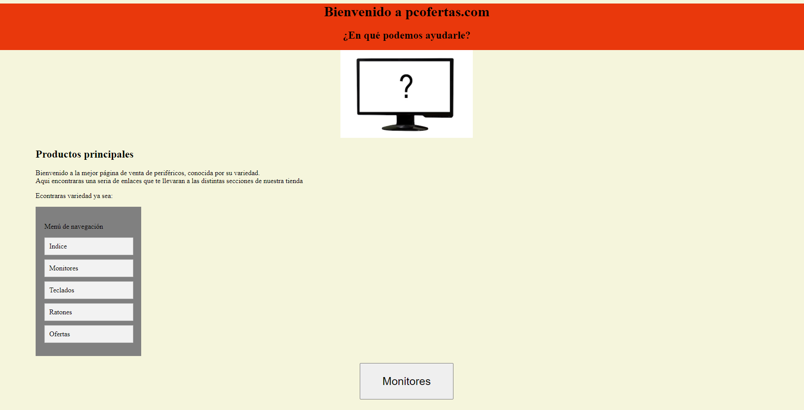
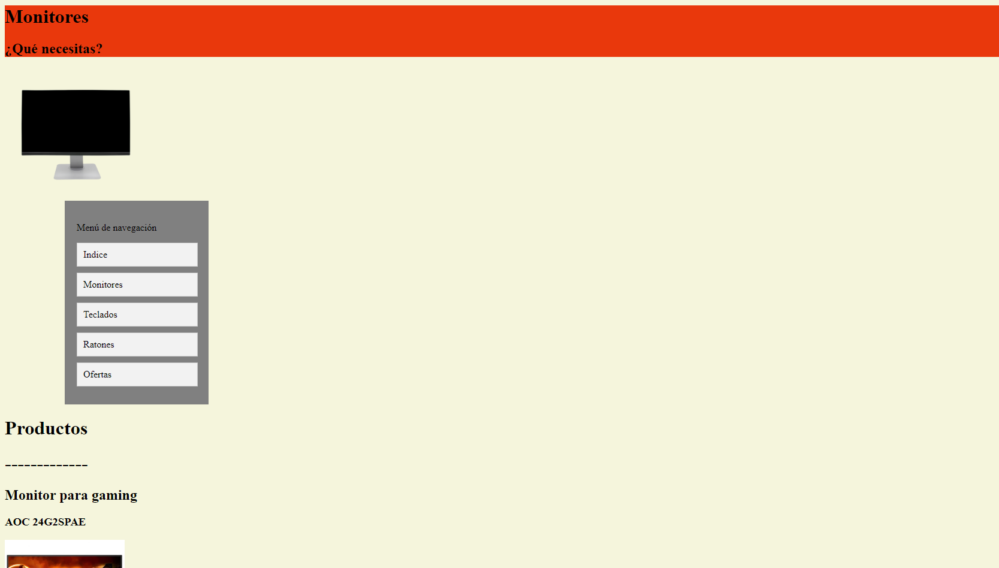
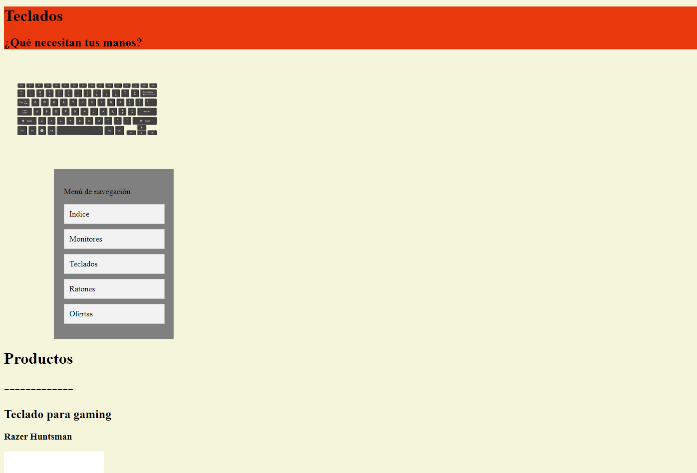
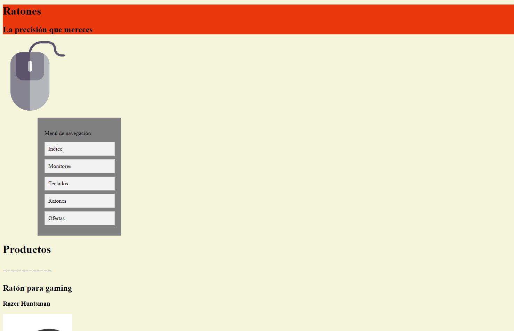
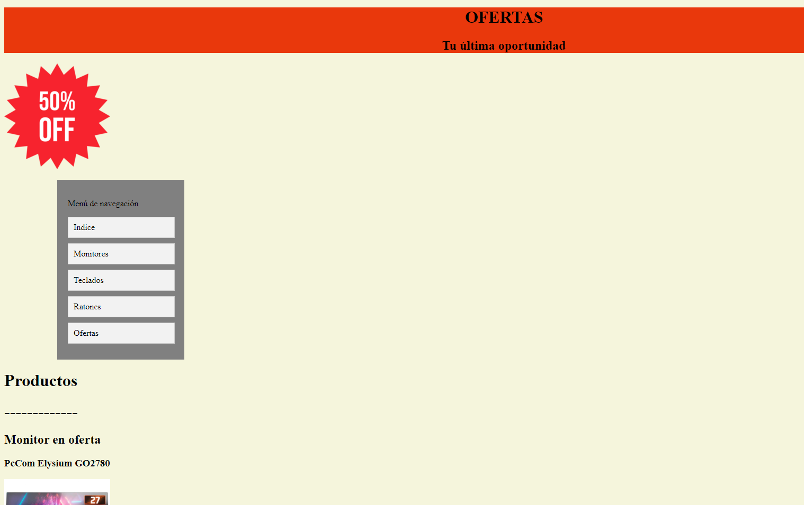
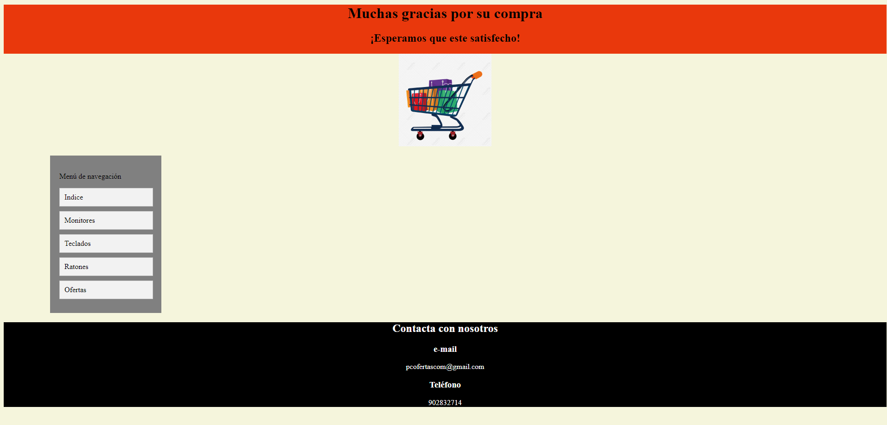

## Estructura de archivos:
- Un archivo principal llamado indice con la portada.
- 4 páginas adicionales de contenido.
- Un menú de navegación que permite ir a todas las páginas estés donde estes.
- Un archivo CSS donde están todos los estilos de la página.
## Tecnologias utilizadas
- Etiquetas href
- Etiqueta de "tachado" de texto
- Etiquetas Div
- Etiquetas button
- Class y ID
- Header, main y footer
- Etiqueta para añadir imagenes
- Etiqueta link para enlazar el archivo CSS
- Atributo media
## Características y funcionalidades
- Página dedicada a la compra online de periféricos
- Posee links y botones funcionales que llevan a otra página, ya sea de contenido o compra
- Tras finalizar una compra puedes volver al indice o a cualquier pagina de contenido para continuar
- Diseño responsive
## Division de tareas
- Trabajo individual
## Capturas de pantalla
- Indice

- Monitores

- Teclados

- Ratones

- Ofertas

- Página de compra
